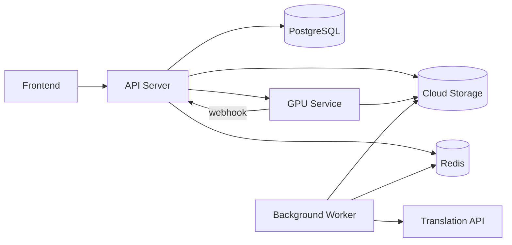
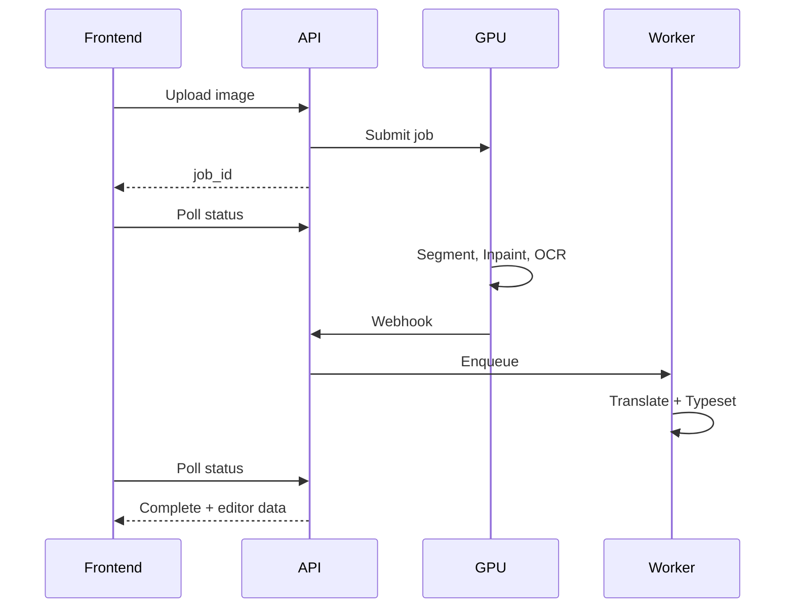
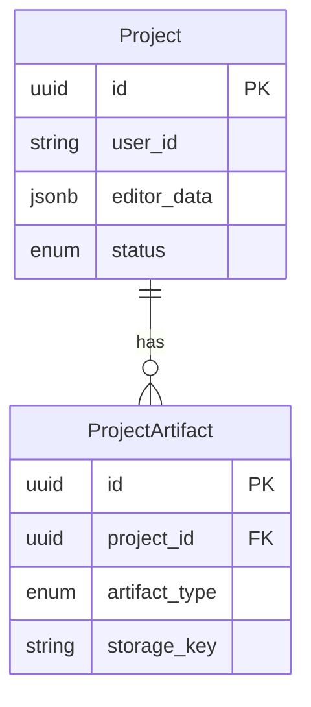

# MangaFuse

MangaFuse is a web application that automates manga scanlation. It takes a raw manga page and produces a fully typeset, editable draft by detecting speech bubbles, removing Japanese text, translating content, and rendering English text with automatic font sizing.

## System Design



## Architecture

The system separates concerns across three services to optimize for cost and performance:

### API Server
A FastAPI application on Render that handles authentication, file uploads, and job orchestration. It never performs heavy computation, keeping response times low. User uploads trigger an async job submission to the GPU service, and the API immediately returns a job ID for polling.

### GPU Service
A stateless Docker container deployed as a serverless endpoint on RunPod. It executes the compute-intensive vision pipeline:

1. **Segmentation** - A fine-tuned YOLO model detects speech bubble polygons
2. **Inpainting** - LaMa neural network removes text while preserving artwork
3. **OCR** - manga-ocr extracts Japanese text from each bubble

The service downloads input from R2, processes it, uploads results back to R2, and sends an HMAC-signed webhook to the API.

### Background Worker
An RQ worker on Render that processes two priority queues (`cpu-high`, `cpu-default`). It handles:

- Translation via Gemini API with batch processing
- Text typesetting with automatic font size fitting
- Re-typesetting on user edits (high priority queue)
- Artifact packaging for downloads

This separation keeps translation and typesetting off the GPU (where they would waste expensive resources) while allowing fast iteration on user edits.

## Data Flow



## Key Design Decisions

### Asynchronous Processing
Long-running AI tasks would cause gateway timeouts if handled synchronously. Instead, the API returns immediately with a job ID. The frontend polls for status updates while processing happens in the background.

### Decoupled GPU and CPU Workloads
GPU time is expensive. By running translation and typesetting on a separate CPU worker, we only use GPU resources for tasks that require them (segmentation, inpainting, OCR). This reduces costs significantly.

### Two-Queue Priority System
User edits go to a high-priority queue (`cpu-high`) while initial processing uses the default queue. This ensures responsive editing even when the system is processing new uploads.

### Presigned URLs for Direct Upload/Download
Files never pass through the API server. Clients upload directly to R2 using presigned URLs, and download artifacts the same way. This reduces server load and bandwidth costs.

### Idempotent Job Submission
Network failures during job submission are handled with idempotency keys stored in Redis. Duplicate requests return the same response without creating duplicate jobs.

### HMAC-Signed Webhooks
The GPU service signs callbacks with a shared secret, preventing spoofed completion notifications.

### Single Source of Truth
The PostgreSQL database owns all project state. The `editor_data` JSONB column stores bubble coordinates, translations, and font sizes. Workers read and write this field atomically using revision numbers to handle concurrent edits.

## Tech Stack

| Layer | Technology |
|-------|------------|
| Frontend | React 19, TypeScript, Vite, TanStack Router/Query, Zustand, Tailwind CSS, Konva |
| API | FastAPI, SQLModel, Alembic, PostgreSQL |
| Queue | RQ, Redis (Upstash) |
| Storage | Cloudflare R2 (S3-compatible) |
| GPU Pipeline | PyTorch, Ultralytics YOLO, simple-lama-inpainting, manga-ocr |
| Translation | Google Gemini API |
| Auth | Clerk |
| Payments | Stripe |
| Deployment | Render (API + Worker), RunPod Serverless (GPU) |

## Project Structure

```
mangafuse/
├── backend/
│   ├── app/
│   │   ├── api/v1/           # REST endpoints, request schemas
│   │   ├── core/             # Config, storage abstraction, logging
│   │   ├── db/               # SQLModel models, session management
│   │   ├── gpu_service/      # FastAPI app for GPU endpoint
│   │   ├── pipeline/         # AI processing modules
│   │   │   ├── inpaint/      # LaMa inpainting, white fill
│   │   │   ├── ocr/          # Text extraction, preprocessing
│   │   │   ├── segmentation/ # YOLO inference
│   │   │   ├── translate/    # Gemini API client
│   │   │   └── typeset/      # Font fitting, text rendering
│   │   └── worker/           # RQ task definitions
│   └── alembic/              # Database migrations
├── frontend/
│   └── src/
│       ├── editor/           # Konva canvas, bubble selection
│       ├── routes/           # Page components
│       └── components/       # Shared UI components
├── assets/
│   ├── fonts/                # Typesetting fonts
│   └── models/               # YOLO weights
└── Dockerfile                # GPU service container
```

## API Design

| Method | Endpoint | Description |
|--------|----------|-------------|
| GET | `/api/v1/projects` | Paginated list of user projects |
| POST | `/api/v1/projects/upload-url` | Get presigned URL for file upload |
| POST | `/api/v1/projects` | Create project, submit to GPU |
| GET | `/api/v1/projects/{id}` | Get status, artifacts, editor data |
| PUT | `/api/v1/projects/{id}` | Update bubble text, trigger re-typeset |
| GET | `/api/v1/projects/{id}/download` | Redirect to presigned download URL |
| POST | `/api/v1/gpu/callback` | Webhook for GPU job completion |

All endpoints except health checks require Clerk JWT authentication. Project endpoints enforce ownership checks.

## Database Schema



## Pipeline Stages

### Segmentation
Uses a YOLO model fine-tuned on manga speech bubbles. Outputs polygon coordinates for each detected bubble along with classification (speech bubble vs. narration box) to inform downstream processing.

### Inpainting
Two strategies based on bubble type:
- **White fill** for standard speech bubbles with white backgrounds
- **LaMa neural inpainting** for complex backgrounds or narration boxes

A text mask is generated using morphological operations to target only the text regions within each bubble.

### OCR
manga-ocr extracts Japanese text from tight crops of each bubble. Preprocessing includes binarization to improve recognition accuracy.

### Translation
Gemini API translates Japanese text to English in batches. The prompt includes context about manga conventions to improve translation quality.

### Typesetting
Text is rendered using PIL with automatic font size fitting. The algorithm:
1. Calculates the writable area from the polygon
2. Binary searches for the largest font size that fits
3. Renders centered text with proper line wrapping
4. Outputs a transparent text layer for compositing

## License

MIT
